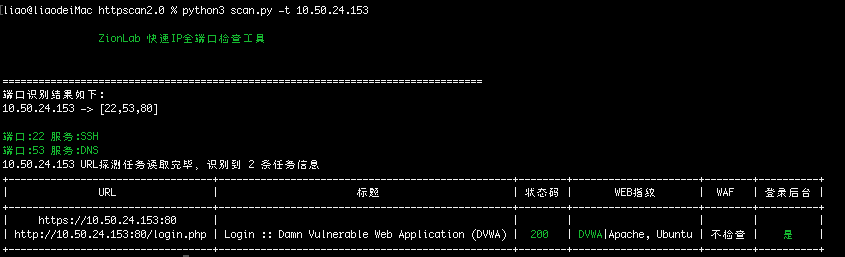

# HttportScan  
HttportScan一款快速全端口扫描的工具，并获取网站标题、指纹识别结果、WAF判断、是否为后台、状态码判断等功能的IP信息收集工具。

## 部署方法
``` 
1.安装rustscan  
docker pull rustscan/rustscan:2.1.1  

2.安装python 依赖库  
pip3 install requirements.txt  
```

##使用方法  
python3 scan.py ip  

### 使用说明  
```
usage: scan.py [-h] [-t TARGET] [-f FILE] [-w] [-s]  

Zionlab快速端口识别工具  

optional arguments:  
  -h, --help                帮助  
  -t TARGET, --target TARGET  
                            扫描单个目标,支持192.168.0.1, 192.168.0.1-100,
                            192.168.0.1-192.168.0.100三种格式  
  -f FILE, --file FILE      扫描目标文件  
  -w, --waf                 是否启用WAF检测,默认不启用  
  -s, --show                列表只展示HTTP服务的信息,默认全展示 
``` 
 

### 功能  
快速扫描约1分钟能完成如下信息获取：  
全端口扫描√  
网站标题获取√  
指纹识别√  
WAF判断√  
后台识别√  
状态码判断√  

### 效果  
如图：  
